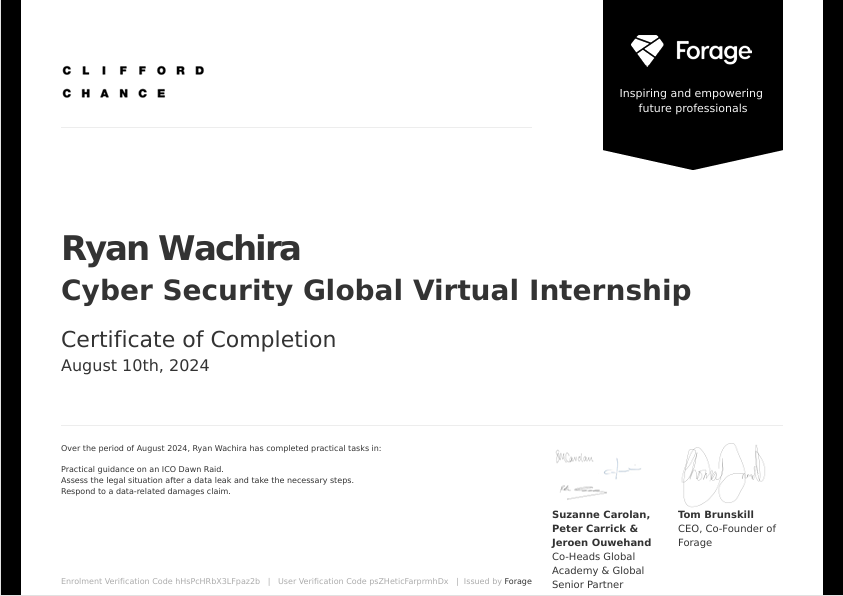

# CLifford Chance Cybersecurity Virtual Internship
## Overview

Welcome to my repository! This collection features the cybersecurity projects I completed during my virtual internship. The internship provided a hands-on experience with real-world scenarios, enhancing my skills in regulatory compliance, data protection, and client communication. Below, you'll find detailed descriptions of each project, along with the specific tasks and skills I developed.

## Projects

### 1. **ICO Dawn Raid Preparation**
   - **Objective**: Prepared communication for a client dealing with an ICO dawn raid. This involved understanding the legal framework around data breaches and providing practical advice to the client on how to handle the situation.
   - **Skills Gained**: Regulatory Compliance, Client Communication, Risk Assessment
   - **Details**: 
     - Drafted an email outlining steps to comply with ICO regulations.
     - Created a checklist for the client to follow during a dawn raid scenario.
   - **Key Takeaways**: Learned the importance of quick and clear communication in compliance-related incidents.

### 2. **GDPR Data Breach Notification**
   - **Objective**: Analyzed a client's data breach and determined the necessary steps for GDPR compliance, including notifying the relevant authorities and affected individuals.
   - **Skills Gained**: Data Protection, Legal Analysis, Communication
   - **Details**: 
     - Assessed the severity of the breach and determined notification obligations under GDPR.
     - Drafted a notification email for the client to send to both authorities and affected parties.
   - **Key Takeaways**: Gained a deeper understanding of GDPR Article 33 and 34 and their implications for data controllers.

### 3. **Defensive Strategy for Data Breach Claims**
   - **Objective**: Developed a defensive strategy for a data center client facing legal claims after a cyber incident resulted in a data breach.
   - **Skills Gained**: Legal Strategy, Data Privacy, Risk Management
   - **Details**: 
     - Summarized potential legal defenses against breach of confidence and GDPR violation claims.
     - Proposed next steps for gathering necessary documentation and preparing for litigation.
   - **Key Takeaways**: Enhanced my ability to assess legal risks and devise strategies to mitigate potential damages.

### 4. **Compliance Risk Assessment**
   - **Objective**: Conducted a compliance risk assessment for a hypothetical client, identifying potential areas of non-compliance and suggesting remedial actions.
   - **Skills Gained**: Risk Assessment, Compliance, Project Management
   - **Details**: 
     - Identified key compliance risks related to data protection and cybersecurity.
     - Created a risk mitigation plan with specific recommendations for the client.
   - **Key Takeaways**: Learned how to systematically identify and prioritize compliance risks in a business setting.

## Skills Developed

- **Regulatory Compliance**: Understanding of GDPR, data protection laws, and how to apply them in real-world scenarios.
- **Client Communication**: Drafted professional communications tailored to compliance and legal situations.
- **Risk Assessment**: Conducted thorough risk assessments and proposed actionable strategies to mitigate risks.
- **Legal Strategy**: Developed defensive strategies for legal claims related to data breaches.
- **Project Management**: Managed multiple tasks and projects efficiently, meeting deadlines and ensuring quality deliverables.

## Certificate of Completion

I successfully completed this virtual internship and earned a certificate. 

Thank you for visiting my repository! If you have any questions or feedback, feel free to reach out.

